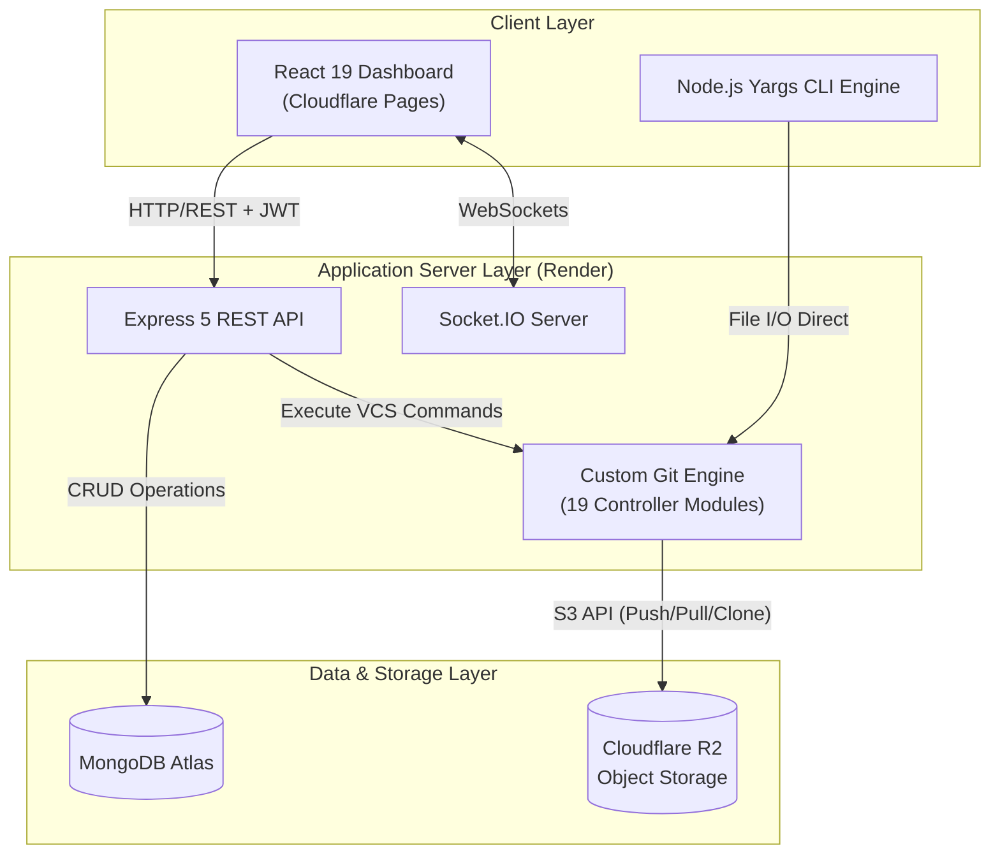
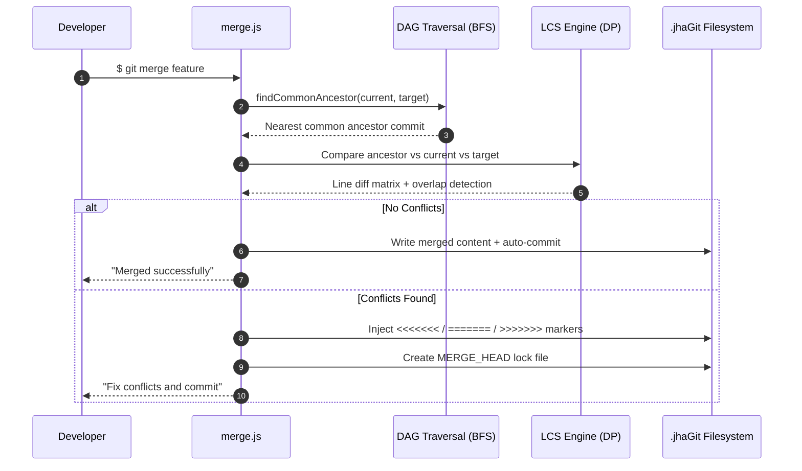
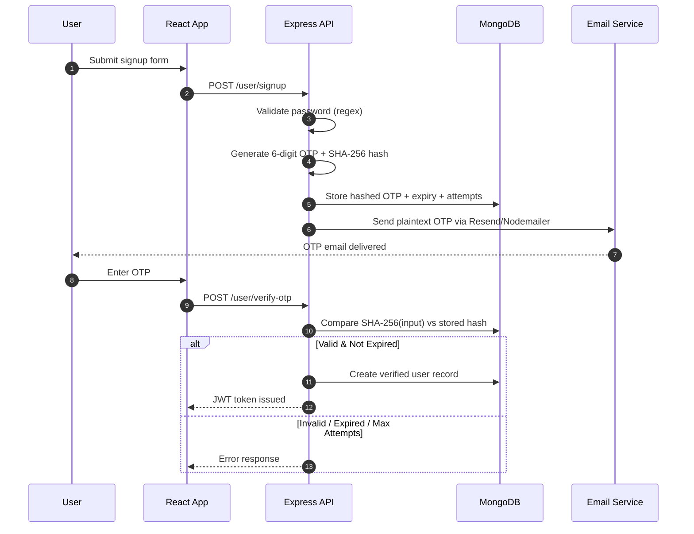

<p align="center">
  <a href="https://jhagit.kunalkj.dev">
    
  </a>
</p>

<h1 align="center">jhaGit</h1>

<p align="center">
  <strong>A full-stack Distributed Version Control System & Code Collaboration Platform — built from scratch.</strong>
</p>

<p align="center">
  
</p>

<p align="center">
  <a href="https://jhagit.kunalkj.dev"></a>
  <a href="https://jhagit-backend.onrender.com"></a>
  <a href="https://github.com/kunaljha17/jhaGit-frontend"></a>
  <a href="https://github.com/kunaljha17/jhaGit-Backend"></a>
</p>

<p align="center">
  
  
  
  
  
</p>

---

## 📋 Table of Contents

- [Live Demo](#-live-demo)
- [Repository Links](#-repository-links)
- [Features](#-features)
- [Tech Stack](#-tech-stack)
- [Architecture](#-architecture)
- [Project Structure](#-project-structure)
- [Screenshots](#-screenshots)
- [Getting Started](#-getting-started)
- [CLI Usage](#-cli-usage)
- [Deployment](#-deployment)
- [Environment Variables](#-environment-variables)
- [Testing](#-testing)
- [Contributing](#-contributing)
- [Author](#-author)


---

## 🌐 Live Demo

| Layer | URL | Platform |
|:------|:----|:---------|
| **Web App (Frontend)** | [https://jhagit.kunalkj.dev](https://jhagit.kunalkj.dev) | Cloudflare Pages |
| **REST API (Backend)** | [https://jhagit-backend.onrender.com](https://jhagit-backend.onrender.com) | Render Web Services |

> **Note:** The backend is hosted on Render's free tier and may experience a ~30–60 second cold start on the first request after periods of inactivity.

---

## 🔗 Repository Links

| Repository | Description | Link |
|:-----------|:------------|:-----|
| **Frontend** | React 19 + Vite 8 web dashboard | [github.com/kunaljha17/jhaGit-frontend](https://github.com/kunaljha17/jhaGit-frontend) |
| **Backend** | Express 5 API + Custom Git Engine + CLI | [github.com/kunaljha17/jhaGit-Backend](https://github.com/kunaljha17/jhaGit-Backend) |

---

## ✨ Features

### 🔧 Custom Version Control Engine (Built From Scratch)
- **Snapshot-based versioning** — Immutable commit snapshots stored under `.jhaGit/commits/<UUID>/`
- **Branch management** — Create, list, and switch branches via `refs/heads/*` pointer files
- **3-Way merge with LCS** — Full Longest Common Subsequence Dynamic Programming merge algorithm with BFS-based common ancestor discovery across multi-parent DAG commit graphs
- **Conflict detection & markers** — Standard `<<<<<<<` / `=======` / `>>>>>>>` conflict markers injected on overlapping edits
- **Staging area** — `git add` stages files to `.jhaGit/staging/` before commit
- **Detached HEAD** — Support for checking out specific commits with a detached HEAD state
- **MERGE_HEAD lock file** — Tracks multi-parent merge relationships during unresolved conflicts
- **File diffing** — Line-by-line diff engine comparing working directory against latest commit
- **Commit log & history** — Full DAG traversal displaying commit ancestry chains
- **Revert** — Restore working directory to any previous commit snapshot

### ☁️ Cloud-Native Remote Sync
- **Push / Pull / Clone** — Custom remote protocols interacting directly with Cloudflare R2 (S3-compatible) Object Storage via `@aws-sdk/client-s3`
- **Zero-dependency cloning** — Repository cloning from R2 without requiring native `git`

### 🔐 Authentication & Security
- **2-Step OTP email verification** — 6-digit OTP via Resend API with SHA-256 hashing (plaintext OTPs never stored)
- **Rate-limiting** — 60-second resend cooldown, 5-attempt max, 10-minute TTL expiry
- **Password strength enforcement** — Regex requiring ≥6 chars, uppercase, digit, and special character
- **JWT session management** — Bearer token authorization for all protected API endpoints
- **Bcrypt password hashing** — Secure credential storage with salted hashing
- **CORS whitelist** — Strict origin-based CORS for cross-domain security

### 🖥️ Interactive Web Dashboard
- **Repository CRUD** — Create, view, edit, and delete repositories with public/private visibility
- **Inline file viewer** — Browse and preview repository files with one-click clipboard copy
- **Inline file committer** — Add/edit files directly from the browser
- **Debounced search (`Ctrl + K`)** — 300ms debounced real-time repository search with global keyboard shortcut
- **Star system** — Star/unstar repositories with optimistic UI updates and live star counts
- **Issue tracker** — Full CRUD issue tracking per repository
- **365-day contribution heatmap** — Multi-source activity aggregation combining repo creations, file commits, issues, and local CLI actions
- **User profiles** — Avatar picker, profile management, and activity overview
- **Skeleton loaders** — Smooth loading states with skeleton placeholders
- **Double-confirmation deletion** — Exact repo name entry required to prevent accidental data loss
- **Dark-themed GitHub-inspired UI** — Built with Primer React components and custom CSS design tokens

### ⚡ Real-Time Communication
- **Socket.IO WebSockets** — Real-time event sync between multiple browser sessions

### 🖥️ Dual Execution Modes
- **CLI Mode** — Full Git-like CLI powered by Yargs for terminal workflows
- **Web Mode** — RESTful API + React dashboard for browser-based collaboration

---

## 🛠️ Tech Stack

| Category | Technologies |
|:---------|:-------------|
| **Languages** | JavaScript (ES6+), HTML5, CSS3 |
| **Frontend** | React 19, React Router 7, Vite 8, Axios, Primer React, `@uiw/react-heat-map` |
| **Backend** | Node.js (v18+), Express.js 5, Yargs (CLI Framework) |
| **Database** | MongoDB Atlas (M0 Tier), Mongoose 9 |
| **Real-Time** | Socket.IO 4, WebSockets |
| **Cloud Storage** | Cloudflare R2 (S3-Compatible), `@aws-sdk/client-s3` |
| **Auth & Security** | JWT, Bcrypt.js, SHA-256 Hashing, Resend API (HTTP REST Email) |
| **Hosting** | Cloudflare Pages (Frontend), Render (Backend) |
| **Algorithms** | Dynamic Programming (LCS), BFS Graph Traversal, Multi-Parent DAG |
| **Testing** | Node.js Assert Module (custom test playbooks) |

---

## 📐 Architecture

### System Architecture Topology



### Custom VCS On-Disk Structure

```
.jhaGit/
├── HEAD                        # Active branch ref or "detached:<commitID>"
├── MERGE_HEAD                  # (Temporary) Exists during unresolved merge
├── config.json                 # Remote bucket configurations
├── staging/                    # Staged files awaiting commit
├── refs/
│   └── heads/
│       ├── main                # → latest commit UUID on main
│       └── feature-branch      # → latest commit UUID on feature-branch
└── commits/
    └── <UUID>/                 # Immutable commit snapshot
        ├── commit.json         # { message, date, parents: [id1, id2] }
        └── <project files>     # Snapshot of staged files at commit time
```

### 3-Way Merge Workflow



### Authentication Flow



---

## 📁 Project Structure

```
jhaGit/
├── README.md                          # ← You are here
│
├── frontend/                          # React 19 + Vite 8 Web Dashboard
│   ├── .env                           # VITE_API_URL
│   ├── index.html                     # Entry HTML
│   ├── package.json                   # Frontend dependencies
│   ├── vite.config.js                 # Vite configuration
│   └── src/
│       ├── main.jsx                   # React root mount
│       ├── App.jsx                    # App shell
│       ├── Routes.jsx                 # Client-side routing (11 routes)
│       ├── authContext.jsx            # Auth context provider
│       ├── api/
│       │   └── axiosClient.js         # Axios HTTP client with base URL
│       ├── components/
│       │   ├── Navbar.jsx / .css      # Global navigation bar
│       │   ├── Footer.jsx / .css      # Global footer
│       │   ├── NotFound.jsx           # 404 page
│       │   ├── auth/                  # Login, Signup, VerifyOtp
│       │   ├── dashboard/             # Main dashboard with search
│       │   ├── repos/                 # CreateRepo, RepoDetails
│       │   ├── user/                  # Profile, HeatMap, AvatarPicker
│       │   ├── issue/                 # Issue tracking (in RepoDetails)
│       │   ├── info/                  # AboutMe, AboutProject, Terms
│       │   ├── ui/                    # ConfirmModal, SkeletonLoader
│       │   └── constants/             # Avatar constants
│       └── assets/                    # SVGs, images
│
├── backend/                           # Express 5 + Custom Git Engine + CLI
│   ├── .env                           # Server environment variables
│   ├── index.js                       # Entry point (server + Yargs CLI)
│   ├── package.json                   # Backend dependencies
│   ├── config/
│   │   ├── mailer.js                  # Resend API email client for OTP delivery
│   │   ├── otp.js                     # OTP generation & SHA-256 utilities
│   │   └── r2_bucket.js              # Cloudflare R2 S3 client config
│   ├── controllers/
│   │   ├── init.js                    # $ git init
│   │   ├── add.js                     # $ git add <file>
│   │   ├── commit.js                  # $ git commit <message>
│   │   ├── branch.js                  # $ git branch [name]
│   │   ├── checkout.js                # $ git checkout <target>
│   │   ├── merge.js                   # $ git merge <branch> (3-way LCS)
│   │   ├── diff.js                    # $ git diff <file>
│   │   ├── log.js                     # $ git log
│   │   ├── status.js                  # $ git status
│   │   ├── push.js                    # $ git push (→ R2)
│   │   ├── pull.js                    # $ git pull (← R2)
│   │   ├── clone.js                   # $ git clone (← R2)
│   │   ├── revert.js                  # $ git revert <commitID>
│   │   ├── headUtils.js               # HEAD resolution helpers
│   │   ├── repoController.js          # Repository CRUD API
│   │   ├── userController.js          # Auth, signup, OTP verification
│   │   ├── issueController.js         # Issue tracking API
│   │   ├── starController.js          # Star/unstar API
│   │   └── activityController.js      # Heatmap aggregation API
│   ├── middleware/
│   │   ├── authMiddleware.js          # JWT token verification
│   │   └── authorizeMiddleware.js     # Authorization checks
│   ├── models/
│   │   ├── userModel.js               # User schema (OTP fields + auth)
│   │   ├── repoModel.js               # Repository schema
│   │   └── issueModel.js              # Issue schema
│   ├── routes/
│   │   ├── main.router.js             # Route aggregator
│   │   ├── user.router.js             # /user/* routes
│   │   ├── repo.router.js             # /repo/* routes
│   │   ├── git.router.js              # /git/* routes (VCS operations)
│   │   └── issue.router.js            # /issue/* routes
│   └── test_*.js                      # Test playbooks (merge, probe)
│
├── about.md                           # Detailed technical analysis document
└── gemini.md                          # Deployment & testing guide
```

---

## 📸 Screenshots

> Visit the live app at **[jhagit.kunalkj.dev](https://jhagit.kunalkj.dev)** to explore the full UI.

### Key Pages

| Page | Route | Description |
|:-----|:------|:------------|
| **Login** | `/auth` | Dark-themed authentication page with form validation |
| **Signup** | `/signup` | Registration form with password strength enforcement |
| **OTP Verification** | `/verify-otp` | 6-digit OTP entry with resend cooldown timer |
| **Dashboard** | `/` | Repository list, debounced search (`Ctrl+K`), suggested repos sidebar |
| **Repository Details** | `/repo/:id` | Tabbed view — Code (file explorer + inline viewer), Issues, Settings |
| **Create Repository** | `/create` | New repo form with public/private toggle |
| **Profile** | `/profile` | User profile with avatar picker and 365-day contribution heatmap |
| **About Project** | `/about-project` | Technical deep-dive documentation |
| **About Me** | `/about-me` | Developer information |
| **404 Not Found** | `*` | Custom 404 error page |

### UI Highlights

- 🌑 **Dark mode** — GitHub-inspired dark theme with custom CSS design tokens
- 📊 **Contribution Heatmap** — 365-day rolling activity calendar (like GitHub's green squares)
- 🔍 **Global Search** — `Ctrl + K` keyboard shortcut for instant repository filtering
- 💀 **Skeleton Loaders** — Smooth placeholder animations during data fetches
- ⚠️ **Confirmation Modals** — Double-confirmation dialogs requiring exact repo name to delete
- ⭐ **Optimistic UI** — Instant star/unstar feedback before server roundtrip completes

---

## 🚀 Getting Started

### Prerequisites

- **Node.js** ≥ 18.x
- **npm** ≥ 9.x
- **MongoDB Atlas** account (free M0 tier works)
- **Cloudflare R2** bucket (for remote push/pull/clone)

### Installation

```bash
# 1. Clone both repositories
git clone https://github.com/kunaljha17/jhaGit-frontend.git frontend
git clone https://github.com/kunaljha17/jhaGit-Backend.git backend

# 2. Install backend dependencies
cd backend
npm install

# 3. Configure backend environment variables (see Environment Variables section)
cp .env.example .env   # Then fill in your values

# 4. Start the backend server
npm start              # Runs: node index.js start

# 5. Install frontend dependencies (in a new terminal)
cd ../frontend
npm install

# 6. Configure frontend environment variable
# Create .env with: VITE_API_URL=http://localhost:3002

# 7. Start the frontend dev server
npm run dev            # Vite dev server on http://localhost:5173
```

---

## 💻 CLI Usage

The backend doubles as a full CLI tool powered by **Yargs**. Run commands directly from the `backend/` directory:

```bash
# Initialize a new repository
node index.js init

# Stage a file
node index.js add <filename>

# Commit staged files
node index.js commit "your commit message"

# View commit history
node index.js log

# Check working directory status
node index.js status

# Show file diff against latest commit
node index.js diff <filename>

# Create a new branch
node index.js branch <branch-name>

# List all branches
node index.js branch

# Switch to a branch or commit
node index.js checkout <branch-or-commitID>

# Merge a branch into current working tree
node index.js merge <branch-name>

# Push commits to Cloudflare R2
node index.js push

# Pull commits from Cloudflare R2
node index.js pull

# Clone a repository from R2
node index.js clone

# Revert to a previous commit
node index.js revert <commitID>

# Start the web server
node index.js start
```

---

## 🌍 Deployment

### Architecture Overview

| Layer | Platform | URL |
|:------|:---------|:----|
| Frontend | Cloudflare Pages | `https://jhagit.kunalkj.dev` |
| Backend | Render (Web Service) | `https://jhagit-backend.onrender.com` |
| Database | MongoDB Atlas (M0) | Internal connection string |
| Object Storage | Cloudflare R2 | Internal, via S3-compatible SDK |

### Pre-Deploy Checklist

- [ ] All `.env` values configured on Render (`MONGODB_URI`, `JWT_SECRET`, `RESEND_API_KEY`, R2 credentials)
- [ ] `VITE_API_URL` set on Cloudflare Pages, pointing to the Render backend URL
- [ ] CORS `allowedOrigins` in Express includes the exact Cloudflare Pages URL (no trailing slash)
- [ ] Socket.IO CORS config matches the same allowed origins
- [ ] MongoDB Atlas Network Access allows `0.0.0.0/0` (Render IPs are dynamic on free tier)
- [ ] `package.json` has correct `start` script matching Render's Start Command

### Redeploy Workflow

```bash
# Backend (Render auto-redeploys on push)
git add .
git commit -m "your message"
git push origin main

# Frontend (Cloudflare Pages auto-redeploys on push)
# Same push triggers it — or manually via Wrangler:
npm run build
wrangler pages deploy dist --project-name=jhagit
```

### Common Issues

| Symptom | Likely Cause | Fix |
|:--------|:-------------|:----|
| Login/signup does nothing | Wrong `VITE_API_URL` | Check env var on Cloudflare Pages, rebuild |
| CORS error in console | Origin mismatch | Verify exact URL in `allowedOrigins` (no trailing slash) |
| Session lost on refresh | Cookie/token not persisting | Check `sameSite`/`secure` cookie settings |
| First request hangs | Render cold start | Wait 30–60s, or use UptimeRobot to keep alive |
| OTP email never arrives | `RESEND_API_KEY` missing/invalid or unverified domain | Verify `RESEND_API_KEY` in Render env vars and sender in Resend dashboard |
| MongoDB connection fails | IP not whitelisted | Confirm Atlas allows `0.0.0.0/0`, check `MONGODB_URI` |

---

## 🔐 Environment Variables

### Backend (`backend/.env`)

```env
# Server Port (Render sets this dynamically)
PORT=3002

# MongoDB Atlas Connection String
MONGODB_URI=mongodb+srv://<username>:<password>@cluster0.mongodb.net/GithubClone?retryWrites=true&w=majority

# JWT Secret
JWT_SECRET=your_jwt_secret_key_here

# Resend API Key for Email OTP Verification
RESEND_API_KEY=re_your_resend_api_key_here

# Cloudflare R2 / S3-Compatible Storage Credentials
R2_ENDPOINT=https://<account_id>.r2.cloudflarestorage.com
R2_ACCESS_KEY_ID=<your_r2_access_key_id>
R2_SECRET_ACCESS_KEY=<your_r2_secret_access_key>
R2_BUCKET_NAME=<your_r2_bucket_name>
```

| Variable | Description |
|:---------|:------------|
| `PORT` | Server port (default: `3002`, auto-set by Render) |
| `MONGODB_URI` | MongoDB Atlas connection string |
| `JWT_SECRET` | Secret key for JWT token signing |
| `RESEND_API_KEY` | Resend API key for OTP email delivery (`re_...`) |
| `R2_ACCESS_KEY_ID` | Cloudflare R2 access key ID |
| `R2_SECRET_ACCESS_KEY` | Cloudflare R2 secret access key |
| `R2_BUCKET_NAME` | R2 bucket name |
| `R2_ENDPOINT` | R2 S3-compatible endpoint URL |

### Frontend (`frontend/.env`)

```env
# Backend API Base URL
VITE_API_URL=https://jhagit-backend.onrender.com
```

| Variable | Description |
|:---------|:------------|
| `VITE_API_URL` | Backend API base URL (e.g., `https://jhagit-backend.onrender.com` or `http://localhost:3002`) |

> ⚠️ **Never commit `.env` files to version control.** Both repositories include `.gitignore` entries for `.env`.

---

## 🧪 Testing

The backend includes custom test playbooks that validate the Git engine's core algorithms:

```bash
# Run merge integration tests
node test_merge_deep.js

# Run merge probe tests
node test_merge_probe.js

# Run full playbook tests
node test_playbook.js
```

### Post-Deploy Smoke Test

After every deployment, verify these critical flows:

1. ✅ Backend health check — visit API root, confirm MongoDB connected in Render logs
2. ✅ Frontend loads — no blank screen or console errors
3. ✅ Auth flow — signup → OTP email → verify → login → session persists on refresh
4. ✅ Core features — create repo → add file → view file → star → create issue
5. ✅ Real-time — open two tabs, confirm Socket.IO events sync
6. ✅ Error handling — wrong credentials show clear error, private repo access blocked

---

## 🤝 Contributing

Contributions, issues, and feature requests are welcome!

1. **Fork** the repository
2. **Create** your feature branch (`git checkout -b feature/amazing-feature`)
3. **Commit** your changes (`git commit -m 'Add some amazing feature'`)
4. **Push** to the branch (`git push origin feature/amazing-feature`)
5. **Open** a Pull Request

---

## 👤 Author

**Kunal Kumar (Kunal Jha)**

- 🎓 3rd Year B.Tech IT — Haldia Institute of Technology (2024–2028)
- 🐙 GitHub: [@kunaljha17](https://github.com/kunaljha17)
- 📧 Email: [jhakunal124@gmail.com](mailto:jhakunal124@gmail.com)
- 📄 Resume: [View Resume on Google Drive](https://drive.google.com/file/d/117rkWSYQNnI7TTd82QmSWimPVQrpsUXY/view?usp=sharing)

---

<p align="center">
  Made with ❤️ by <a href="https://github.com/kunaljha17">Kunal Jha</a>
</p>
